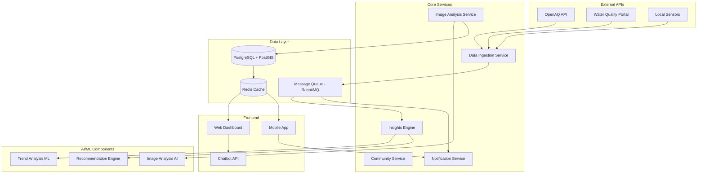

# EcoSense.ai Design Document

## Overview

EcoSense.ai is built as a microservices-based environmental intelligence platform that combines real-time data ingestion, AI-powered image analysis, and community engagement features. The architecture follows event-driven patterns to handle high-volume data processing while maintaining responsive user experiences.

The platform consists of several core services: Data Ingestion Service, Image Analysis Service, Insights Engine, Community Service, and Frontend Dashboard, all orchestrated through a message queue system and backed by a geospatially-enabled database.

## Architecture

### High-Level Architecture



### Technology Stack

- **Backend**: Node.js with TypeScript, Express.js
- **Database**: PostgreSQL with PostGIS extension for geospatial data
- **Cache**: Redis for session management and frequently accessed data
- **Message Queue**: RabbitMQ for asynchronous processing
- **AI/ML**: Python with TensorFlow/PyTorch for image analysis, scikit-learn for trend analysis
- **Frontend**: React with TypeScript, Material-UI for web dashboard
- **Mobile**: React Native for cross-platform mobile app
- **Deployment**: Docker containers, Kubernetes for orchestration
- **Monitoring**: Prometheus + Grafana for metrics, ELK stack for logging

## Components and Interfaces

### 1. Data Ingestion Service

**Purpose**: Fetches and processes environmental data from external APIs and local sensors.

**Key Interfaces**:
```typescript
interface EnvironmentalDataPoint {
  id: string;
  source: 'openaq' | 'water_quality_portal' | 'local_sensor';
  pollutant: string;
  value: number;
  unit: string;
  location: {
    latitude: number;
    longitude: number;
    address?: string;
  };
  timestamp: Date;
  quality_grade: 'A' | 'B' | 'C' | 'D';
}

interface DataIngestionConfig {
  apis: {
    openaq: { endpoint: string; apiKey: string; rateLimit: number };
    waterQuality: { endpoint: string; rateLimit: number };
  };
  scheduledJobs: {
    airQuality: { interval: string; enabled: boolean };
    waterQuality: { interval: string; enabled: boolean };
  };
}
```

**Core Functions**:
- Scheduled data fetching with exponential backoff retry logic
- Data validation and quality scoring
- Geospatial data normalization
- Message queue publishing for downstream processing

### 2. Image Analysis Service

**Purpose**: Processes user-uploaded environmental images using AI to detect pollution indicators.

**Key Interfaces**:
```typescript
interface ImageUpload {
  id: string;
  userId: string;
  imageUrl: string;
  metadata: {
    timestamp: Date;
    location?: { latitude: number; longitude: number };
    deviceInfo: string;
  };
  analysisStatus: 'pending' | 'processing' | 'completed' | 'failed';
}

interface ImageAnalysisResult {
  imageId: string;
  pollutionIndicators: {
    airQuality: { smogDensity: number; visibility: number; confidence: number };
    waterQuality: { turbidity: number; colorIndex: number; confidence: number };
    visualContamination: { detected: boolean; type: string; confidence: number };
  };
  overallScore: number;
  recommendations: string[];
}
```

**AI Model Components**:
- Pre-trained CNN for environmental scene classification
- Custom models for turbidity detection in water images
- Air quality assessment based on visibility and color analysis
- Confidence scoring and uncertainty quantification

### 3. Insights Engine

**Purpose**: Analyzes environmental trends and generates actionable insights and recommendations.

**Key Interfaces**:
```typescript
interface TrendAnalysis {
  location: { latitude: number; longitude: number; radius: number };
  timeframe: { start: Date; end: Date };
  pollutantType: string;
  trend: {
    direction: 'improving' | 'worsening' | 'stable';
    magnitude: number;
    confidence: number;
  };
  healthImpact: {
    riskLevel: 'low' | 'moderate' | 'high' | 'very_high';
    affectedPopulation: number;
    recommendations: string[];
  };
}

interface CommunityRecommendation {
  id: string;
  location: { latitude: number; longitude: number; radius: number };
  priority: 'low' | 'medium' | 'high' | 'urgent';
  category: 'immediate_action' | 'long_term_strategy' | 'monitoring';
  title: string;
  description: string;
  steps: string[];
  estimatedImpact: number;
  feasibilityScore: number;
}
```

**Analysis Algorithms**:
- Time series analysis for trend detection
- Correlation analysis between different pollution sources
- Health impact modeling based on WHO guidelines
- Machine learning for recommendation personalization

### 4. Community Service

**Purpose**: Manages user engagement, gamification, and community features.

**Key Interfaces**:
```typescript
interface UserProfile {
  id: string;
  location: { latitude: number; longitude: number };
  preferences: {
    notifications: boolean;
    activityTypes: string[];
    healthConditions: string[];
  };
  gamification: {
    points: number;
    level: number;
    badges: string[];
    contributionStreak: number;
  };
}

interface CommunityAction {
  id: string;
  userId: string;
  actionType: 'photo_upload' | 'data_verification' | 'remediation_activity';
  location: { latitude: number; longitude: number };
  timestamp: Date;
  impact: {
    pointsEarned: number;
    environmentalBenefit: string;
  };
}
```

### 5. Notification Service

**Purpose**: Handles real-time alerts and mobile push notifications.

**Key Interfaces**:
```typescript
interface NotificationRule {
  userId: string;
  location: { latitude: number; longitude: number; radius: number };
  triggers: {
    pollutantThresholds: { [pollutant: string]: number };
    trendAlerts: boolean;
    communityUpdates: boolean;
  };
  deliveryMethods: ('push' | 'email' | 'sms')[];
}

interface Alert {
  id: string;
  type: 'health_warning' | 'trend_alert' | 'community_update';
  severity: 'info' | 'warning' | 'critical';
  title: string;
  message: string;
  location: { latitude: number; longitude: number };
  expiresAt: Date;
}
```

## Data Models

### Core Environmental Data Schema

```sql
-- Environmental measurements table
CREATE TABLE environmental_data (
    id UUID PRIMARY KEY DEFAULT gen_random_uuid(),
    source VARCHAR(50) NOT NULL,
    pollutant VARCHAR(50) NOT NULL,
    value DECIMAL(10,4) NOT NULL,
    unit VARCHAR(20) NOT NULL,
    location GEOMETRY(POINT, 4326) NOT NULL,
    address TEXT,
    timestamp TIMESTAMP WITH TIME ZONE NOT NULL,
    quality_grade CHAR(1) CHECK (quality_grade IN ('A', 'B', 'C', 'D')),
    created_at TIMESTAMP WITH TIME ZONE DEFAULT NOW()
);

-- Spatial index for efficient location queries
CREATE INDEX idx_environmental_data_location ON environmental_data USING GIST (location);
CREATE INDEX idx_environmental_data_timestamp ON environmental_data (timestamp);
CREATE INDEX idx_environmental_data_pollutant ON environmental_data (pollutant);

-- Image analysis results table
CREATE TABLE image_analyses (
    id UUID PRIMARY KEY DEFAULT gen_random_uuid(),
    user_id UUID NOT NULL,
    image_url TEXT NOT NULL,
    location GEOMETRY(POINT, 4326),
    upload_timestamp TIMESTAMP WITH TIME ZONE NOT NULL,
    analysis_results JSONB NOT NULL,
    overall_score DECIMAL(3,2) CHECK (overall_score >= 0 AND overall_score <= 1),
    status VARCHAR(20) DEFAULT 'pending',
    created_at TIMESTAMP WITH TIME ZONE DEFAULT NOW()
);

-- User profiles and gamification
CREATE TABLE users (
    id UUID PRIMARY KEY DEFAULT gen_random_uuid(),
    email VARCHAR(255) UNIQUE NOT NULL,
    location GEOMETRY(POINT, 4326),
    preferences JSONB DEFAULT '{}',
    points INTEGER DEFAULT 0,
    level INTEGER DEFAULT 1,
    badges TEXT[] DEFAULT '{}',
    contribution_streak INTEGER DEFAULT 0,
    created_at TIMESTAMP WITH TIME ZONE DEFAULT NOW()
);

-- Community actions and contributions
CREATE TABLE community_actions (
    id UUID PRIMARY KEY DEFAULT gen_random_uuid(),
    user_id UUID REFERENCES users(id),
    action_type VARCHAR(50) NOT NULL,
    location GEOMETRY(POINT, 4326),
    timestamp TIMESTAMP WITH TIME ZONE NOT NULL,
    points_earned INTEGER DEFAULT 0,
    impact_description TEXT,
    created_at TIMESTAMP WITH TIME ZONE DEFAULT NOW()
);
```

### Caching Strategy

**Redis Cache Structure**:
- `current_conditions:{lat}:{lng}:{radius}` - Current environmental conditions for location
- `user_dashboard:{user_id}` - Personalized dashboard data
- `trend_analysis:{location_hash}:{timeframe}` - Cached trend analysis results
- `community_leaderboard:{location_hash}` - Community engagement rankings
- `notification_queue:{user_id}` - Pending notifications for users

## Error Handling

### API Error Handling Strategy

1. **External API Failures**:
   - Implement circuit breaker pattern for external API calls
   - Exponential backoff with jitter for retry logic
   - Fallback to cached data when APIs are unavailable
   - Graceful degradation with user notifications about data staleness

2. **Image Processing Errors**:
   - Validate image format and size before processing
   - Timeout handling for long-running AI analysis
   - Fallback to basic metadata extraction if AI analysis fails
   - User-friendly error messages with retry options

3. **Database Connection Issues**:
   - Connection pooling with automatic reconnection
   - Read replica failover for query operations
   - Transaction rollback and retry for write operations
   - Health check endpoints for monitoring database status

4. **Real-time Notification Failures**:
   - Message queue persistence for failed deliveries
   - Alternative delivery methods (email fallback for push failures)
   - User preference management for notification channels
   - Batch processing for high-volume notification periods

### Error Response Format

```typescript
interface ErrorResponse {
  error: {
    code: string;
    message: string;
    details?: any;
    timestamp: Date;
    requestId: string;
  };
  fallback?: {
    data: any;
    source: string;
    lastUpdated: Date;
  };
}
```

## Testing Strategy

### Unit Testing
- **Coverage Target**: 90% code coverage for core business logic
- **Framework**: Jest for JavaScript/TypeScript, pytest for Python AI components
- **Mock Strategy**: Mock external APIs, database connections, and AI model inference
- **Test Data**: Synthetic environmental data and sample images for consistent testing

### Integration Testing
- **API Testing**: Automated tests for all REST endpoints using Supertest
- **Database Testing**: Test database operations with test containers
- **Message Queue Testing**: Verify asynchronous processing workflows
- **External API Testing**: Contract testing with API mocking services

### End-to-End Testing
- **User Workflows**: Automated browser testing with Playwright
- **Mobile Testing**: React Native testing with Detox
- **Performance Testing**: Load testing with k6 for high-traffic scenarios
- **Accessibility Testing**: Automated accessibility testing with axe-core

### AI/ML Model Testing
- **Model Validation**: Cross-validation with held-out environmental image datasets
- **Performance Metrics**: Precision, recall, F1-score for pollution detection
- **Bias Testing**: Evaluate model performance across different geographic regions
- **A/B Testing**: Compare model versions in production with gradual rollout

### Monitoring and Observability
- **Application Metrics**: Response times, error rates, throughput
- **Business Metrics**: User engagement, data quality scores, prediction accuracy
- **Infrastructure Metrics**: Database performance, cache hit rates, queue depths
- **Alerting**: Automated alerts for system health, data quality issues, and user experience degradation